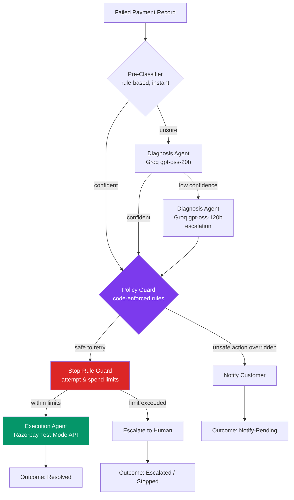
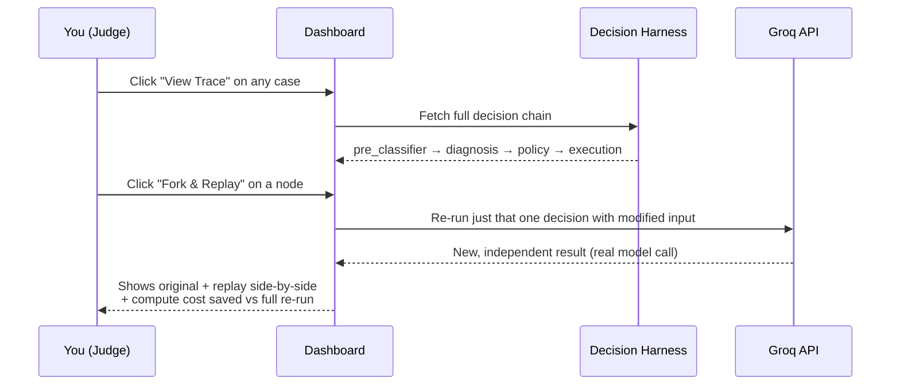
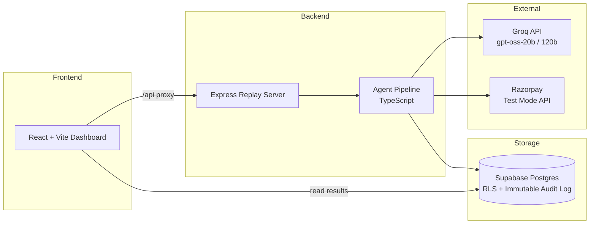

# RAZAR — Revenue Recovery Agent with Auditable Decision Harness

> Built for the Razorpay Buildathon 2026 — **Track 03: AI Revenue Recovery**

RAZAR is a multi-agent system that finds failed payments, figures out *why*
they failed, decides what to do about it, and — unlike most "AI agent" demos —
lets you click into and re-verify every single decision it made, live.


---

## The problem

Payment failures are common and mostly recoverable — a bank timeout, an
expired UPI mandate, a gateway error. Most systems either retry blindly
(wasting attempts on cases that can never succeed) or don't retry at all
(leaving recoverable revenue stuck). The harder problem isn't recovering
the money — it's proving your recovery agent made the *right* call, every
time, and can show its work.

## The result (real, DB-backed, not simulated)

| Metric | Value |
|---|---|
| Total volume processed | ₹15,72,249.23 across 63 failed payments |
| Directly recovered | **41.76%** via automated, policy-checked retries |
| Customer notified (unfixable automatically) | 30.16% |
| Wasteful retries | **₹0.00** — 0 cases |
| Overall diagnosis accuracy | **95.24%** (rule-based: 97.62%, AI-diagnosed: 90.48%) |
| Stop-rule safety blocks | 12 cases, fully logged, none hidden |

Full numbers: [`harness/batch_eval_results_FINAL.json`](./harness/batch_eval_results_FINAL.json)

---

## How it works



Every box above writes a node into the **Decision Harness** — a database
table where every input, output, confidence score, and cost is permanently
recorded and cannot be edited or deleted (enforced by a database-level
trigger, not just application code).

---

## Why this is different from "just another agent demo"

Most agent projects show you the *outcome*. RAZAR shows you the *decision
trail* behind every outcome, and lets you interrogate it live:



We also **red-teamed our own agent** with prompt-injection attacks before
anyone else could — [see the security audit](./harness/docs/SECURITY_AUDIT.md)
for the full breakdown, including the one real bypass we found and fixed.

---

## Architecture



**Stack:** React + Vite + TypeScript · Node.js/Express · Supabase (Postgres,
RLS-secured) · Groq (dual-model routing) · Razorpay Test-Mode API · Zod
(schema validation on every AI output)

---

## What makes each decision trustworthy

| Layer | What it guarantees |
|---|---|
| **Zod validation** | Every AI response is schema-checked before any code touches it — malformed or off-spec output is rejected, never silently trusted |
| **Policy Guard** | A deterministic, code-level rule set that can override the AI's suggested action — e.g. an AI can never trigger a retry on an expired mandate, even if it suggests one |
| **Stop-Rule Guard** | Hard limits on retry attempts and spend, enforced in code, not left to AI judgment |
| **Immutable audit trail** | A PostgreSQL trigger blocks any UPDATE or DELETE on a recorded decision — the trail can't be edited after the fact, by anyone, including us |
| **Row Level Security** | The database itself denies public/anonymous access; only the backend service can read or write |

---

## Project layout

```
harness/
├── migrations/          SQL schema (tables, RLS policies, immutability trigger)
├── src/
│   ├── agents/           pre_classifier, diagnosis_agent, action_decision_agent, execution_agent
│   ├── policy/            enforcePolicy() — the safety layer
│   ├── harness.ts         the decision DAG recorder + fork/replay engine
│   ├── pipeline.ts        orchestrates the full decision flow
│   ├── batchRunner.ts     runs the pipeline across a batch
│   ├── metrics.ts         computes honest, ground-truth-scored metrics
│   └── replayServer.ts    Express API for live Fork & Replay
├── data/                 synthetic benchmark + adversarial edge-case datasets
└── docs/                 security audit, PRD

ui/
├── src/components/
│   ├── PaymentsTable.tsx     the batch dashboard table
│   ├── DagTraceViewer.tsx    the per-case decision trace + Fork & Replay
│   └── LiveHealthIndicator.tsx   live Groq/Supabase status
```

---

## Running it locally

```bash
# Terminal 1 — backend + replay API
cd harness
npm install
npm run replay:server        # http://localhost:3001

# Terminal 2 — frontend dashboard
cd ui
npm install
npm run dev                  # http://localhost:5173
```

Re-run the full benchmark:
```bash
cd harness
npm run seed:db        # seed 63 canonical records into Supabase
npm run eval:batch     # run the full pipeline, get metrics
npm run eval:edge      # run the 30-record adversarial/edge-case stress test
```

---

## Honest limitations (we'd rather you hear it from us)

- Recovery rate is 41.76%, not 100% — by design. Some failures (expired
  mandates, insufficient funds) genuinely can't be auto-fixed and are
  routed to customer notification instead of a pointless retry.
- We investigated integrating India's public cybercrime/fraud-signal data
  (I4C, DoT's Financial Risk Indicator) for a related risk-check feature —
  no public API exists for either, so we scoped this build around data we
  could fully verify and control instead. Outreach for future access is in
  progress.
- This is a hackathon-stage build on synthetic data — real production use
  would need live payment data integration, monitoring, and a longer
  security review beyond what we completed here.

---

## Team

Built by Nitin — B.Sc. Computer Science, BITS Pilani (in partnership with
NxtWave), Hyderabad.
